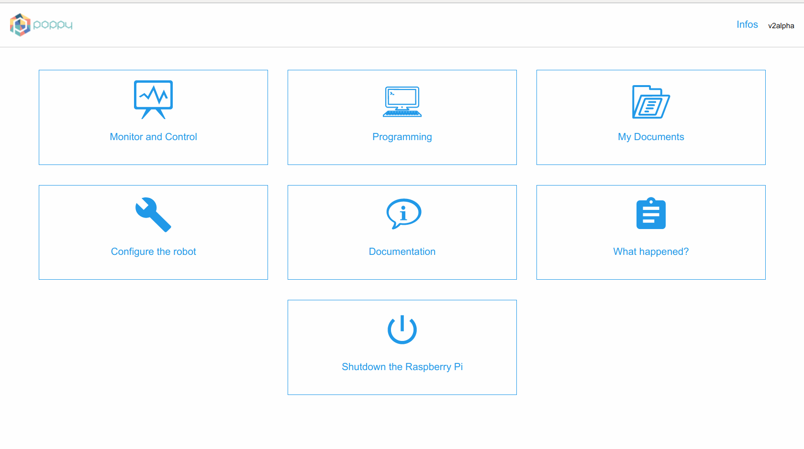

# Puppet Master: a Control Web Interface for Poppy robots.

**Warning: Puppet Master is only intended to work on a Raspberry-Pi [correctly setup](https://github.com/poppy-project/raspoppy) to work with Poppy robots. You should not run it on your own computer!**

## Installation

* Download this repository. And extract it.

* Install the dependencies ([Flask](http://flask.pocoo.org), [pyyaml](https://bitbucket.org/xi/pyyaml), and [requests](http://docs.python-requests.org/en/master/)) via:

```bash
pip install -r requirements.txt
```

* You need to download [snap](http://snap.berkeley.edu) and unzip it in the main folder (i.e. alongside the *static* folder as *snap*).

* You also have to download [poppy-monitor](https://github.com/poppy-project/poppy-monitor) and unzip it in the same folder as *monitor*.

* You also need to have [Jupyter](http://jupyter.org) installed and launched. The interface simply redirects to the default jupyter url (using the 8888 port).


## Usage

To start the web interface, simply run the *bouteillederouge.py* script:

```bash
python bouteillederouge.py
```

It will start the webserver bind on 0.0.0.0 and use the default port 5000. So, you can now connect to http://localhost:5000 and see this:



You can run it in test mode that can be used on any computer without risking erasing anything via. The debug flag is for Flask debug mode:

```bash
python bouteillederouge.py --debug --test
```
